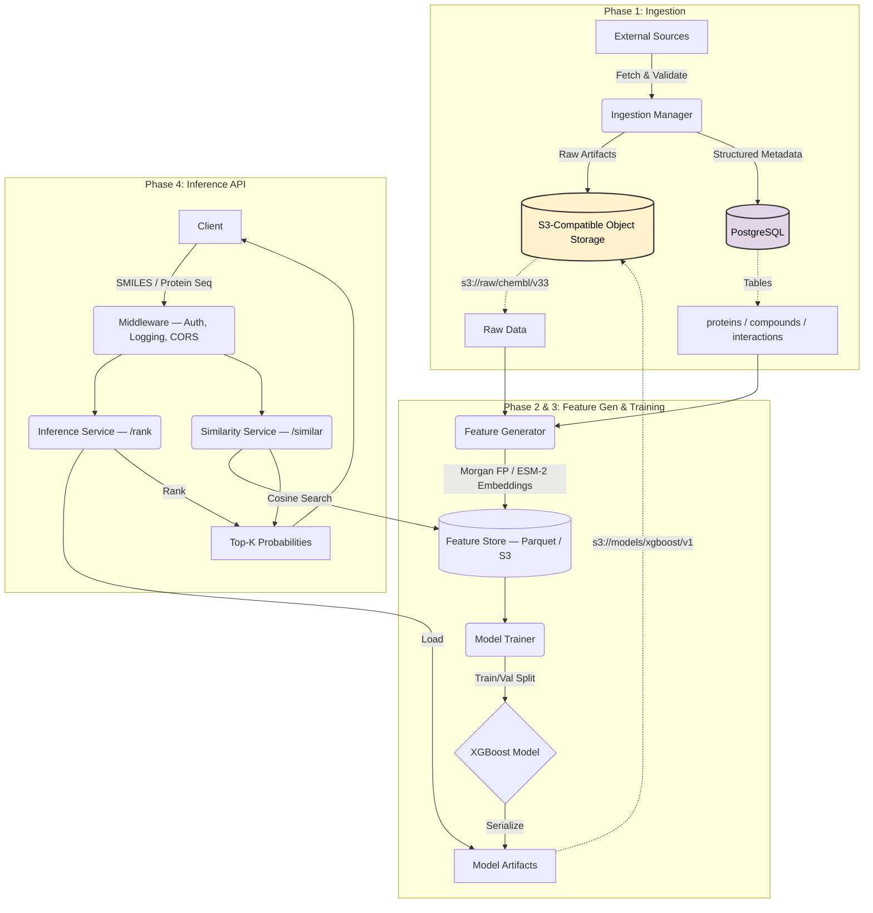
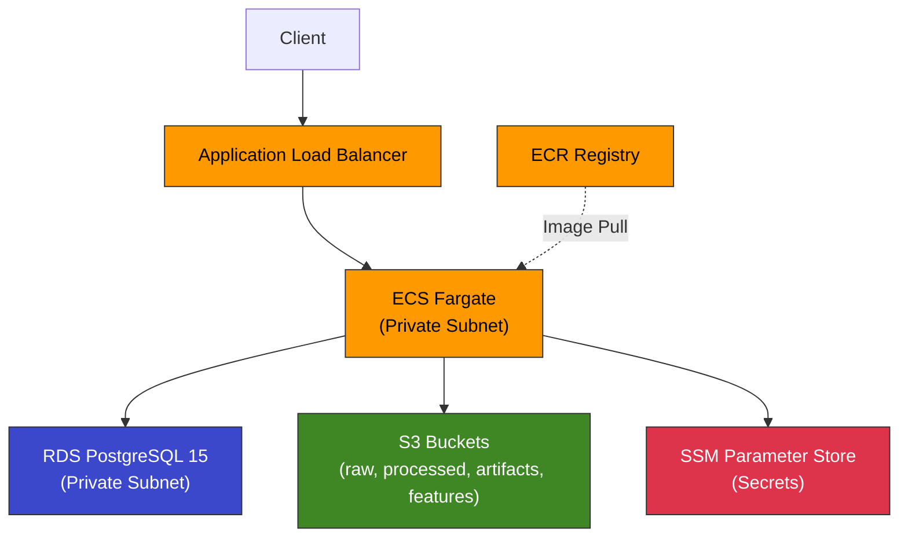

# Biological Molecular Interaction Intelligence

**AI-Assisted Drug–Protein Interaction (DTI) Ranking Platform**

## Problem Statement

Drug discovery is notoriously expensive and time-consuming. A significant bottleneck is identifying target proteins for small-molecule candidates. **Biological Molecular Interaction Intelligence** addresses this by providing a **reproducible, production-grade computational pipeline** to rank likely protein targets for a given small-molecule drug.

**Goal**: **Search-space reduction**. We prioritize the top 0.1% of experiments most likely to succeed.

---

## Production Architecture

The system is designed for **reproducibility**, **extensibility**, and **traceability**, treating Data and Models as versioned artifacts.



## Core Principles

1.  **Reproducibility First**: Every artifact is content-addressed and checksummed.
2.  **Extensibility**: Plug in proprietary assays (CSV/SDF) or custom models via `DataSource` and `ModelWrapper` interfaces.
3.  **Traceability**: Full lineage from Ingestion Run -> Feature Version -> Model Artifact -> Prediction.
4.  **Security**: Explicit configuration. No implicit defaults. Source-agnostic identity.

## Repository Structure

```
├── src/
│   ├── ingestion/          # Data Sources, Parsers, Storage Layout
│   │   ├── interfaces.py       # DataSource ABC
│   │   ├── sources.py          # ChEMBL, UniProt fetchers
│   │   ├── parsers.py          # SDF, FASTA, CSV parsers
│   │   ├── storage.py          # S3-compatible object storage
│   │   └── manager.py          # IngestionManager orchestrator
│   ├── features/           # Molecular Featurization
│   │   ├── morgan.py           # RDKit Morgan fingerprints (ECFP4)
│   │   ├── protein_embeddings.py  # ESM-2 embeddings via HuggingFace
│   │   ├── store.py            # Parquet feature store (S3)
│   │   └── manager.py          # FeaturizationManager orchestrator
│   ├── models/             # Training & Scoring
│   │   ├── xgboost_model.py    # XGBoost wrapper (train/predict/save/load)
│   │   ├── scoring.py          # SimilarityScorer, LearnedScorer strategies
│   │   ├── evaluator.py        # AUROC, AUPRC, accuracy metrics
│   │   ├── training_data.py    # TrainingDataBuilder (stratified splits)
│   │   └── trainer.py          # TrainingManager orchestrator
│   ├── inference/          # API Services
│   │   ├── service.py          # InferenceService (/rank)
│   │   ├── similarity.py       # SimilarityService (/similar)
│   │   └── schemas.py          # Pydantic request/response models
│   ├── db/                 # Database
│   │   ├── models.py           # SQLAlchemy ORM (proteins, compounds, interactions)
│   │   └── database.py         # Engine & session factory
│   ├── config.py           # Pydantic Settings (env-driven)
│   ├── main.py             # FastAPI app (/rank, /similar, /health, /metrics)
│   ├── middleware.py       # API key auth, request logging
│   ├── metrics.py          # Prometheus counters & histograms
│   ├── logging_config.py   # structlog configuration
│   └── tracing.py          # OpenTelemetry setup
├── infra/                  # Terraform IaC
│   ├── main.tf                 # Root module composition
│   ├── variables.tf            # Input variables
│   ├── outputs.tf              # Stack outputs (ALB URL, ECR, RDS)
│   └── modules/
│       ├── networking/         # VPC, subnets, NAT, security groups
│       ├── database/           # RDS PostgreSQL 15
│       ├── storage/            # S3 buckets (raw, processed, artifacts, features)
│       ├── ecr/                # Container registry
│       ├── ecs/                # Fargate cluster, ALB, auto-scaling
│       └── secrets/            # SSM Parameter Store
├── migrations/             # Alembic database migrations
├── docs/                   # Documentation
├── tests/                  # 79 unit + integration tests
├── Dockerfile              # Multi-stage production build
├── docker-compose.yml      # Local stack (Postgres + MinIO)
└── pyproject.toml          # Poetry dependency management
```

## Implementation Status

| Phase | Status | Highlights |
|-------|--------|-----------|
| **1. Ingestion** | ✅ Complete | SDF/FASTA/CSV parsers, S3 storage layout, PostgreSQL metadata |
| **2. Featurization** | ✅ Complete | Morgan fingerprints (ECFP4), ESM-2 protein embeddings, Parquet feature store |
| **3. Training** | ✅ Complete | XGBoost baseline, TrainingDataBuilder, ModelEvaluator (AUROC/AUPRC) |
| **4. Inference API** | ✅ Complete | `/rank`, `/similar`, `/health` endpoints, API key auth, Prometheus metrics |
| **5. Infrastructure** | ✅ Complete | Terraform IaC for AWS (ECS Fargate, RDS, S3, ALB) |

## AWS Production Architecture



Fully provisioned via Terraform (6 modules). See [docs/migration.md](docs/migration.md) for the full local → production migration plan.

## Getting Started

```bash
# Local development
cp .env.example .env
docker-compose up -d
poetry install && poetry run pytest
```

See also: [API docs](docs/api.md) · [Testing guide](docs/testing.md) · [Migration](docs/migration.md)

## Why This Architecture

The system cleanly separates immutable scientific artifacts (S3) from mutable relational metadata (PostgreSQL), enabling reproducible experiments, safe re-ingestion, and independent evolution of data, features, and models.

The prototype defaults to deterministic similarity-based ranking using pretrained open-source models. The scoring layer is designed to be pluggable, allowing future introduction of learned scoring functions without changing the ingestion or inference pipeline.

## Key Technology Choices

| Decision | Chosen | Alternatives Considered | Rationale |
|---|---|---|---|
| **Protein Embeddings** | HuggingFace `transformers` | Facebook `fair-esm`, PyTorch Hub | Model-agnostic: swap ESM-2 → ProtTrans/Ankh via one config change. Standard tokenizer API handles padding/truncation. |
| **Compound Fingerprints** | RDKit Morgan (ECFP4) | MACCS, Avalon, MAP4 | Industry standard for DTI. Deterministic, fast, no model weights. |
| **Feature Persistence** | Parquet on S3 | HDF5, CSV, Delta Lake | Columnar, compressed, schema-enforced. Direct compatibility with pandas/PyArrow. |
| **Deployment** | ECS Fargate | Lambda, EKS, EC2 | ML models stay loaded in memory (no cold starts). Serverless containers with auto-scaling. |
| **IaC** | Terraform | CDK, CloudFormation | Multi-cloud portable, HCL is readable, mature module ecosystem. |
