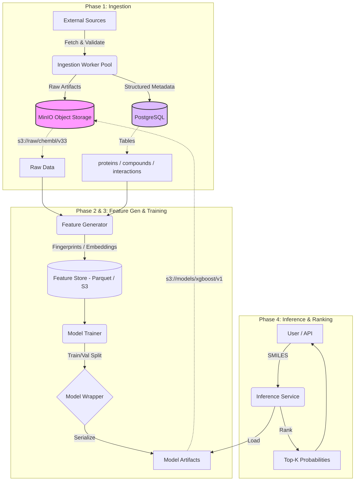

# Biological Molecular Interaction Intelligence

**AI-Assisted Drug–Protein Interaction (DTI) Ranking Platform**

## Problem Statement

Drug discovery is notoriously expensive and time-consuming. A significant bottleneck is identifying target proteins for small-molecule candidates. **Biological Molecular Interaction Intelligence** addresses this by providing a **reproducible, production-grade computational pipeline** to rank likely protein targets for a given small-molecule drug.

**Goal**: **Search-space reduction**. We prioritize the top 0.1% of experiments most likely to succeed.

---

## Production Architecture

The system is designed for **reproducibility**, **extensibility**, and **traceability**, treating Data and Models as versioned artifacts.



## Core Principles

1.  **Reproducibility First**: Every artifact is content-addressed and checksummed.
2.  **Extensibility**: Plug in proprietary assays (CSV/SDF) or custom models via `DataSource` and `ModelWrapper` interfaces.
3.  **Traceability**: Full lineage from Ingestion Run -> Feature Version -> Model Artifact -> Prediction.
4.  **Security**: Explicit configuration. No implicit defaults. Source-agnostic identity.

## Repository Structure

```
├── src/
│   ├── ingestion/      # Data Sources, Parsers, Storage Layout
│   ├── features/       # Molecular Featurization Logic
│   ├── models/         # Model Wrappers
│   ├── db/             # Database Models & Connection
│   ├── config.py       # Configuration Management
│   └── main.py         # FastAPI Entrypoint
├── migrations/         # Alembic Database Migrations
├── docs/               # Architecture & Standards Documentation
├── tests/              # Unit & Integration Tests
├── docker-compose.yml  # Local stack (Postgres + MinIO)
└── pyproject.toml      # Dependency Management
```

## Implementation Status (Phase 1)

**Scope**:
Phase 1 focuses on deterministic ingestion, identity normalization, and metadata persistence. Feature generation, training, and inference components are scaffolded but not yet production-enabled.

**Database Schema**:
*   Strict `(source, external_id)` identity for Proteins, Compounds, and Interactions.
*   Interaction identity is source-scoped (`external_id` refers to the source record ID).
*   UUIDs with server-side generation (`gen_random_uuid`).
*   JSONB metadata support.

**Storage**:
*   S3/MinIO agnostic via `src/ingestion/storage.py`.
*   Strict layout: `raw/<source>/<version>/<sha256>/<file>`.

**Parsers**:
*   `SDFParser` (Chemical structures via RDKit).
*   `FastaParser` (Protein sequences via Biopython).
*   `CSVParser` (Chunked Pandas processing).

## Getting Started

1.  **Environment Setup**:
    ```bash
    cp .env.example .env
    # Edit .env with your configuration
    docker-compose up -d
    ```

2.  **Run Migrations**:
    ```bash
    docker-compose run --rm app poetry run alembic upgrade head
    ```

3.  **Run Tests** (Requires local environment):
    ```bash
    poetry install
    poetry run pytest
    ```

## Why This Architecture

The system cleanly separates immutable scientific artifacts (S3) from mutable relational metadata (PostgreSQL), enabling reproducible experiments, safe re-ingestion, and independent evolution of data, features, and models.

The prototype defaults to deterministic similarity-based ranking using pretrained open-source models. The scoring layer is designed to be pluggable, allowing future introduction of learned scoring functions without changing the ingestion or inference pipeline.

## Product Roadmap

**Phase 2: Molecular Featurization**
*   ECFP4/Morgan Fingerprints generation.
*   Protein Embedding (ESM-2 / ProtTrans) integration.
*   Feature Store implementation (Parquet/S3).

**Phase 3: Model Training**
*   XGBoost / Random Forest baseline models.
*   Deep Learning (Graph Neural Networks) advanced models.
*   Experiment Tracking (MLflow integration).

**Phase 4: Inference API**
*   FastAPI serving layer.
*   Real-time similarity search.
*   Dockerized deployment.


