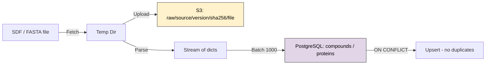

# Data After Phase 1: Ingestion

After a successful Phase 1 ingestion run, data lives in two locations:
**PostgreSQL** (structured metadata) and **S3** (raw artifacts).

---

## PostgreSQL

### `ingestion_runs` — Audit Trail

Every pipeline execution creates exactly one row, regardless of outcome.

| Column | Example |
|---|---|
| `run_id` | `a3b8d1b6-0b3b-4b1a-...` |
| `source` | `chembl` |
| `status` | `COMPLETED` / `FAILED` |
| `stats` | `{"estimated_compounds": 2400000}` |
| `checksums` | `{"sha256": "e3b0c44298fc..."}` |
| `started_at` | `2026-02-09 14:00:00+00` |
| `ended_at` | `2026-02-09 14:12:33+00` |

### `compounds` — Small Molecules

One row per unique `(source, external_id)`. Upserted on re-ingestion.

| Column | Example |
|---|---|
| `id` | `f81d4fae-7dec-11d0-...` (UUID) |
| `source` | `chembl` |
| `external_id` | `ASPIRIN` (from SDF `_Name` or configured prop) |
| `smiles` | `CC(=O)Oc1ccccc1C(=O)O` |
| `metadata` | `{"chembl_id": "CHEMBL113", "MolWt": 180.16}` |

```sql
-- Identity constraint (dedup key)
UNIQUE (source, external_id)
```

### `proteins` — Target Proteins

One row per unique `(source, external_id)`. Upserted on re-ingestion.

| Column | Example |
|---|---|
| `id` | `4192bff0-e1e0-43ce-...` (UUID) |
| `source` | `uniprot` |
| `external_id` | `P12345` |
| `sequence` | `MKWVTFISLLFLFSSAYSRGVFRR...` |
| `metadata` | `{"description": "sp\|P12345\|ALBU_HUMAN"}` |

```sql
-- Identity constraint (dedup key)
UNIQUE (source, external_id)
```

### `interactions` — Binding Relationships

Links compounds to proteins. Not yet populated in Phase 1 (requires interaction CSV data).

| Column | Type | Notes |
|---|---|---|
| `compound_id` | FK → `compounds.id` | Indexed |
| `protein_id` | FK → `proteins.id` | Indexed |
| `label` | `int` | 0/1 classification |
| `affinity_value` | `float` | e.g. IC50 in nM |
| `source` | `str` | Origin dataset |

---

## S3 Object Storage

Raw files are stored with a **content-addressed layout** — the SHA-256 hash ensures identical files map to the same key.

The filename is derived from the registered source name: `{source_name}_raw.gz`. Nothing is ChEMBL- or UniProt-specific.

```
raw/
├── chembl/
│   └── v33/
│       └── e3b0c44298fc1c14/
│           └── chembl_raw.gz          ← dynamically named from source="chembl"
├── uniprot/
│   └── 2024_01/
│       └── a1b2c3d4e5f6a7b8/
│           └── uniprot_raw.gz         ← dynamically named from source="uniprot"
└── pharma_x/
    └── 2024Q1/
        └── d4e5f6a7b8c9d0e1/
            └── pharma_x_raw.gz        ← proprietary source, same layout
```

**Key format:** `raw/<source>/<version>/<sha256_prefix>/<source>_raw.gz`

- `<source>` — whatever name you pass to `register_source()`
- `<version>` — from `DataSource.discover()["version"]`
- Re-ingesting the **same file** overwrites the same key (idempotent)
- Re-ingesting a **different version** creates a new key (both preserved)

---

## Data Flow Summary



## Scale Reference

| Source | Records | Raw File | Format |
|---|---|---|---|
| ChEMBL v33 | ~2.4M compounds | ~1.5 GB gzipped | SDF |
| UniProt Swiss-Prot | ~570K proteins | ~90 MB gzipped | FASTA |
