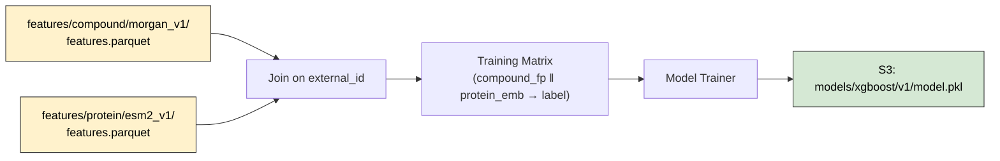

# Data After Phase 2: Molecular Featurization

After Phase 2, two new artifact types exist in S3 alongside the raw data from Phase 1.
PostgreSQL remains unchanged — features live exclusively in S3 as Parquet files.

---

## What Changes (vs Phase 1)

| Layer | Phase 1 | Phase 2 adds |
|---|---|---|
| **PostgreSQL** | `compounds`, `proteins`, `interactions`, `ingestion_runs` | No schema changes |
| **S3 `raw/`** | Raw SDF, FASTA files | No changes |
| **S3 `features/`** | _(empty)_ | Parquet feature files + manifests |

---

## S3 Feature Store Layout

```
features/
├── compound/
│   └── morgan_v1/
│       ├── features.parquet       ← 2048-dim fingerprint vectors
│       └── manifest.json          ← reproducibility metadata
└── protein/
    └── esm2_v1/
        ├── features.parquet       ← 320-dim embedding vectors
        └── manifest.json
```

**Key format:** `features/<entity_type>/<generator_version>/`

- `<entity_type>` — `compound` or `protein`
- `<generator_version>` — e.g. `morgan_v1`, `esm2_v2` (bumped on parameter change)
- Old versions are retained — never overwritten

---

## Compound Features (Parquet)

Generated by: **RDKit Morgan Fingerprints (ECFP4)**

### Schema

| Column | Type | Description |
|---|---|---|
| `external_id` | `string` | Matches `compounds.external_id` in PostgreSQL |
| `source` | `string` | Origin dataset (e.g. `chembl`, `pharma_x`) |
| `fp_0` … `fp_2047` | `uint8` (0 or 1) | 2048-bit Morgan fingerprint |

### Sample Row

```
external_id: "ASPIRIN"
source:      "chembl"
fp_0:        0
fp_1:        1
fp_2:        0
...
fp_2047:     1
```

### Parameters (frozen in manifest.json)

```json
{
  "type": "morgan",
  "radius": 2,
  "n_bits": 2048,
  "rdkit_version": "2023.9.5",
  "generated_at": "2026-02-10T14:00:00Z",
  "row_count": 2400000,
  "source_filter": null
}
```

---

## Protein Features (Parquet)

Generated by: **ESM-2 (facebook/esm2_t6_8M_UR50D)**

### Schema

| Column | Type | Description |
|---|---|---|
| `external_id` | `string` | Matches `proteins.external_id` in PostgreSQL |
| `source` | `string` | Origin dataset (e.g. `uniprot`, `pharma_x`) |
| `emb_0` … `emb_319` | `float32` | 320-dim mean-pooled embedding |

### Sample Row

```
external_id: "P12345"
source:      "uniprot"
emb_0:       -0.0234
emb_1:        0.1567
...
emb_319:      0.0891
```

### Parameters (frozen in manifest.json)

```json
{
  "type": "esm2",
  "model": "facebook/esm2_t6_8M_UR50D",
  "dim": 320,
  "pooling": "mean",
  "max_seq_length": 1024,
  "generated_at": "2026-02-10T15:30:00Z",
  "row_count": 570000,
  "source_filter": null
}
```

> [!IMPORTANT]
> **Why self-hosted ESM-2?**
>
> Unlike text (OpenAI/Cohere) or images, there is no "Titan-style" managed embedding service for life sciences yet. Protein embeddings are highly sensitive to:
> 1. **Model Architecture** (ESM-2 vs ProtTrans vs AlphaFold)
> 2. **Pooling Strategy** (Mean vs CLS vs Per-Residue)
> 3. **Reproducibility** — Features must remain bit-exact for years to support long-running drug discovery campaigns.
>
> Changes in the upstream model version would silently invalidate all trained downstream models. Running `facebook/esm2` locally ensures we own the exact versioning and reproducibility of the featurization pipeline.

> [!WARNING]
> **Production GPU Switch Required**
>
> Local dev uses **CPU-only PyTorch** (~200 MB, fast builds). Production deployments with large protein sets **must** switch to GPU:
> ```bash
> # Local (default) — CPU-only, fast builds
> docker-compose build
>
> # Production — CUDA 12.1 GPU support
> docker build --build-arg TORCH_INDEX_URL=https://download.pytorch.org/whl/cu121 .
> ```
> The `TORCH_INDEX_URL` build arg in the `Dockerfile` controls this. No code changes needed.

## How Phase 3 Consumes This



The training matrix is formed by joining compound fingerprints and protein embeddings on the `interactions` table:

```sql
SELECT
    c.external_id AS compound_id,
    p.external_id AS protein_id,
    i.label,
    i.affinity_value
FROM interactions i
JOIN compounds c ON c.id = i.compound_id
JOIN proteins  p ON p.id = i.protein_id
```

Then for each pair, the corresponding feature vectors are looked up from Parquet and concatenated: `[fp_0..fp_2047 | emb_0..emb_319]` → 2368-dim input vector.

---

## Scale Reference

| Feature Set | Rows | Columns | Approx. File Size |
|---|---|---|---|
| Compound fingerprints (ECFP4) | ~2.4M | 2050 (id + source + 2048 bits) | ~600 MB Parquet |
| Protein embeddings (ESM-2 8M) | ~570K | 322 (id + source + 320 floats) | ~700 MB Parquet |
