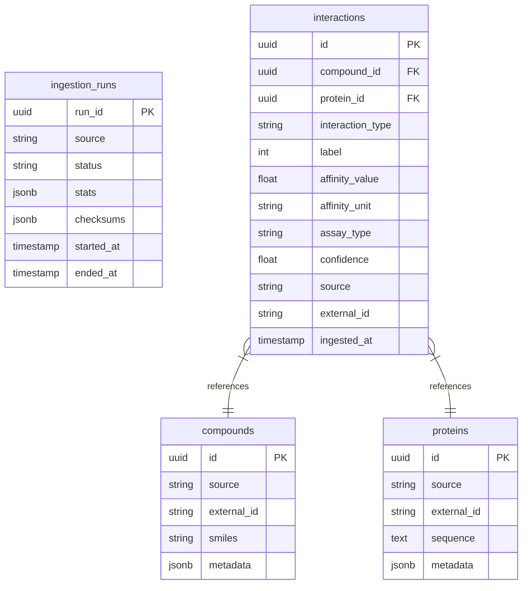
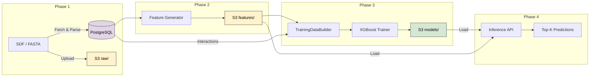

# Data Model

Complete reference for all data artifacts produced by the pipeline.

## Entity Relationship Diagram



**Constraints:** `UNIQUE(source, external_id)` on proteins, compounds, and interactions.

---

## Layer Overview

| Layer | Contents | Written By |
|-------|----------|-----------|
| PostgreSQL | Compounds, proteins, interactions, ingestion audit trail | Phase 1: Ingestion |
| S3 `raw/` | Gzipped SDF, FASTA source files | Phase 1: Ingestion |
| S3 `features/` | Parquet feature vectors + manifests | Phase 2: Featurization |
| S3 `models/` | Serialized model + evaluation report | Phase 3: Training |
| API (in-memory) | Ranked predictions, similarity results | Phase 4: Inference |

---

## Phase 1: Ingestion

### PostgreSQL Tables

**`ingestion_runs`** — Audit trail. One row per pipeline execution.

| Column | Example |
|--------|---------|
| `run_id` | `a3b8d1b6-...` (UUID) |
| `source` | `chembl` |
| `status` | `COMPLETED` / `FAILED` |
| `stats` | `{"estimated_compounds": 2400000}` |
| `checksums` | `{"sha256": "e3b0c442..."}` |
| `started_at` / `ended_at` | timestamps |

**`compounds`** — One row per unique `(source, external_id)`. Upserted on re-ingestion.

| Column | Example |
|--------|---------|
| `external_id` | `ASPIRIN` |
| `smiles` | `CC(=O)Oc1ccccc1C(=O)O` |
| `metadata` | `{"chembl_id": "CHEMBL113", "MolWt": 180.16}` |

**`proteins`** — One row per unique `(source, external_id)`. Upserted on re-ingestion.

| Column | Example |
|--------|---------|
| `external_id` | `P12345` |
| `sequence` | `MKWVTFISLLFLFSSAYS...` |
| `metadata` | `{"description": "sp|P12345|ALBU_HUMAN"}` |

**`interactions`** — Compound ↔ Protein binding relationships.

| Column | Type | Notes |
|--------|------|-------|
| `compound_id` | FK → `compounds.id` | Indexed |
| `protein_id` | FK → `proteins.id` | Indexed |
| `label` | `int` | 0/1 binding classification |
| `affinity_value` | `float` | e.g. IC50 in nM |
| `source` | `str` | Origin dataset |

### S3 Raw Artifacts

Content-addressed layout — SHA-256 hash ensures identical files map to the same key.

```
raw/
├── chembl/v33/<sha256>/chembl_raw.gz
├── uniprot/2024_01/<sha256>/uniprot_raw.gz
└── pharma_x/2024Q1/<sha256>/pharma_x_raw.gz
```

**Key format:** `raw/<source>/<version>/<sha256_prefix>/<source>_raw.gz`

---

## Phase 2: Featurization

Feature vectors stored as Parquet in S3. PostgreSQL unchanged.

### S3 Feature Store Layout

```
features/
├── compound/
│   └── morgan_v1/
│       ├── features.parquet       ← 2048-dim fingerprint vectors
│       └── manifest.json          ← reproducibility metadata
└── protein/
    └── esm2_v1/
        ├── features.parquet       ← 320-dim embedding vectors
        └── manifest.json
```

### Compound Features — Morgan Fingerprints (ECFP4)

| Column | Type | Description |
|--------|------|-------------|
| `external_id` | `string` | Matches `compounds.external_id` |
| `source` | `string` | Origin dataset |
| `fp_0` … `fp_2047` | `uint8` | 2048-bit Morgan fingerprint (0/1) |

**Manifest:**

```json
{
  "type": "morgan",
  "radius": 2,
  "n_bits": 2048,
  "rdkit_version": "2023.9.5",
  "row_count": 2400000
}
```

### Protein Features — ESM-2 Embeddings

| Column | Type | Description |
|--------|------|-------------|
| `external_id` | `string` | Matches `proteins.external_id` |
| `source` | `string` | Origin dataset |
| `emb_0` … `emb_319` | `float32` | 320-dim mean-pooled embedding |

**Manifest:**

```json
{
  "type": "esm2",
  "model": "facebook/esm2_t6_8M_UR50D",
  "dim": 320,
  "pooling": "mean",
  "max_seq_length": 1024,
  "row_count": 570000
}
```

> [!IMPORTANT]
> **Why self-hosted ESM-2?** Unlike text (OpenAI/Cohere), there is no managed embedding service for proteins. Running `facebook/esm2` locally ensures bit-exact reproducibility across long-running drug discovery campaigns.

---

## Phase 3: Training

### Training Matrix

Formed by joining compound fingerprints + protein embeddings on the `interactions` table:

```
[fp_0..fp_2047 | emb_0..emb_319] → 2368-dim input vector → label (0/1)
```

Split via `TrainingDataBuilder` with stratified sampling (no compound leakage between train/test).

### S3 Model Artifacts

```
models/
└── xgboost/
    └── v1/
        ├── model.pkl              ← Serialized XGBoost model
        └── evaluation_report.json ← Metrics snapshot
```

**Model signature** (embedded in artifact):

```json
{
  "sha256": "a1b2c3d4...",
  "feature_version": "morgan_v1+esm2_v1",
  "trained_at": "2026-02-10T16:00:00Z"
}
```

**Evaluation report:**

```json
{
  "auroc": 0.87,
  "auprc": 0.72,
  "accuracy": 0.81,
  "average_precision": 0.74,
  "train_size": 180000,
  "test_size": 20000
}
```

### Scoring Strategies

| Strategy | Input | Output | When Used |
|----------|-------|--------|-----------|
| `SimilarityScorer` | Query FP + candidate embeddings | Cosine similarity ∈ [0, 1] | Default (no trained model) |
| `LearnedScorer` | Concatenated feature vectors | P(binding) ∈ [0, 1] | After model training |

Configured via `SCORING_STRATEGY` env var. Factory: `get_scoring_strategy()`.

---

## Phase 4: Inference API

No new persistent artifacts. The API loads models and features into memory at startup.

### `/rank` Response

```json
{
  "smiles": "CC(=O)Oc1ccccc1C(=O)O",
  "top_k": 3,
  "model_version": "v1",
  "results": [
    {"rank": 1, "external_id": "P31749", "source": "uniprot", "score": 0.943},
    {"rank": 2, "external_id": "P00533", "source": "uniprot", "score": 0.871},
    {"rank": 3, "external_id": "P04637", "source": "uniprot", "score": 0.812}
  ]
}
```

### `/similar` Response

```json
{
  "query": "MKWVTFISLLFLFSSAYS...",
  "entity_type": "protein",
  "top_k": 3,
  "similarity_metric": "cosine",
  "results": [
    {"rank": 1, "external_id": "P12345", "source": "uniprot", "score": 0.95},
    {"rank": 2, "external_id": "P67890", "source": "uniprot", "score": 0.88},
    {"rank": 3, "external_id": "Q11111", "source": "uniprot", "score": 0.76}
  ]
}
```

---

## Data Flow (End-to-End)



## Scale Reference

| Artifact | Rows | Dimensions | Approx. Size |
|----------|------|-----------|-------------|
| Compound fingerprints | ~2.4M | 2048 bits | ~600 MB Parquet |
| Protein embeddings | ~570K | 320 floats | ~700 MB Parquet |
| Raw SDF (ChEMBL v33) | ~2.4M | — | ~1.5 GB gzipped |
| Raw FASTA (UniProt) | ~570K | — | ~90 MB gzipped |
| XGBoost model | 1 | — | ~5 MB pkl |
