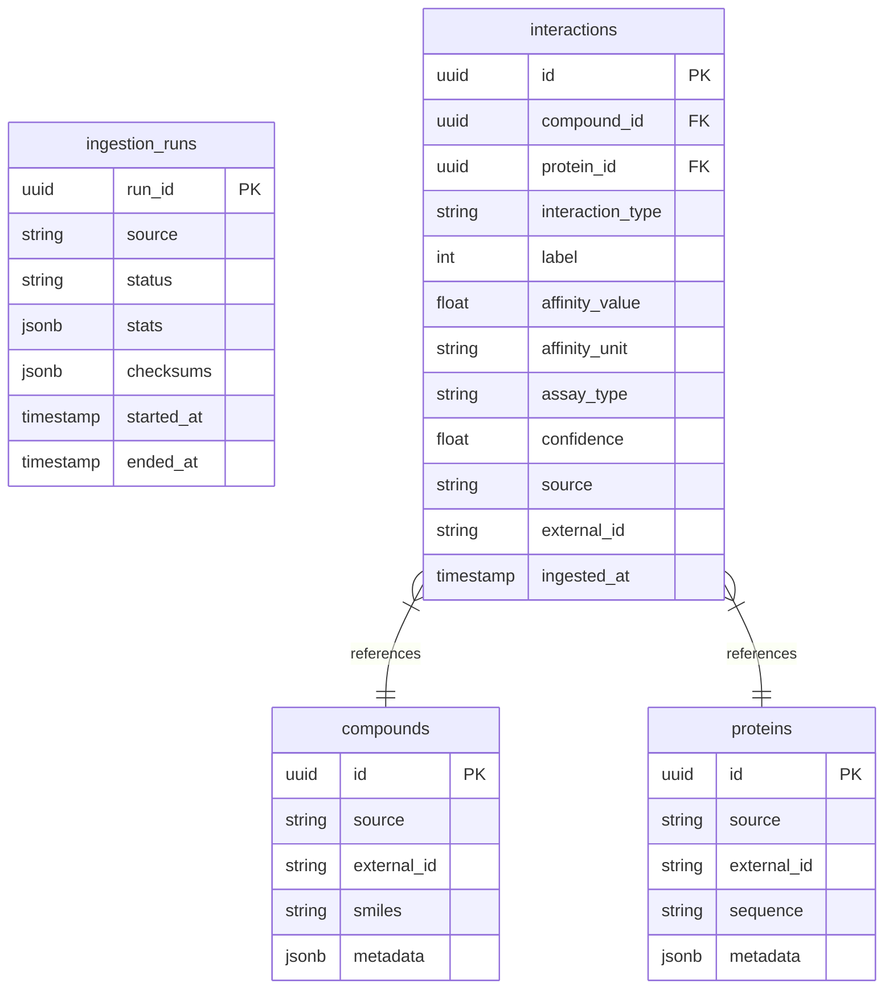

# Database Schema

## Entity Relationship Diagram

## Constraints

*   **Proteins**: `UNIQUE(source, external_id)`
*   **Compounds**: `UNIQUE(source, external_id)`
*   **Interactions**: `UNIQUE(source, external_id)`
    *   *Note: `external_id` refers to the source-provided record identifier.*
